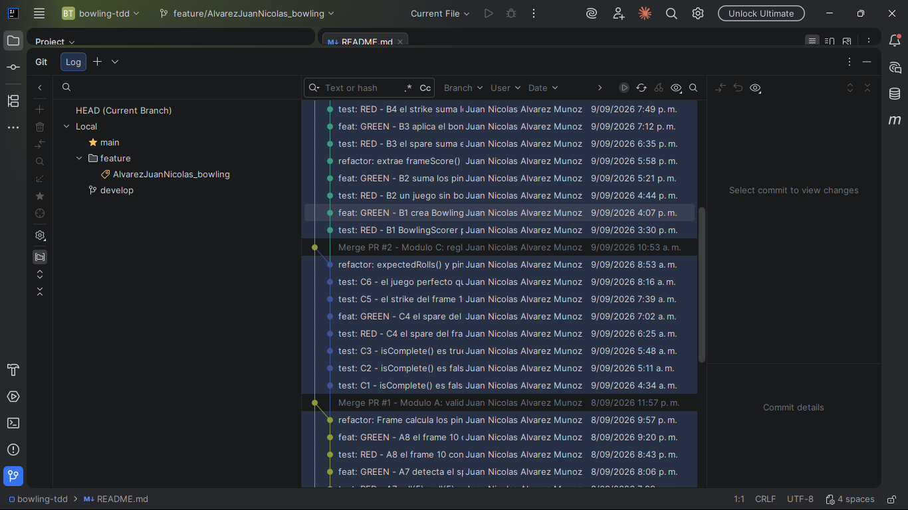
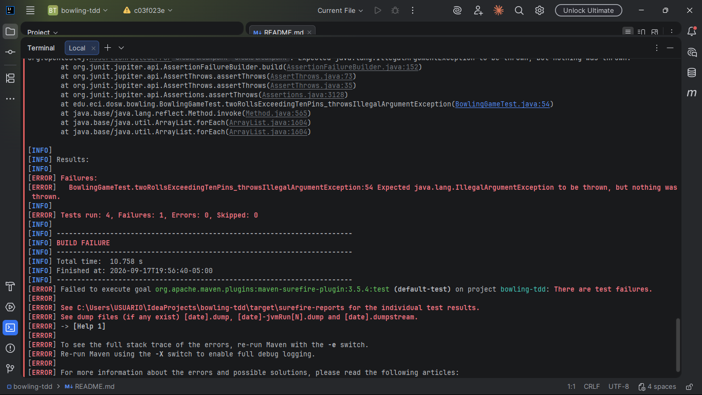
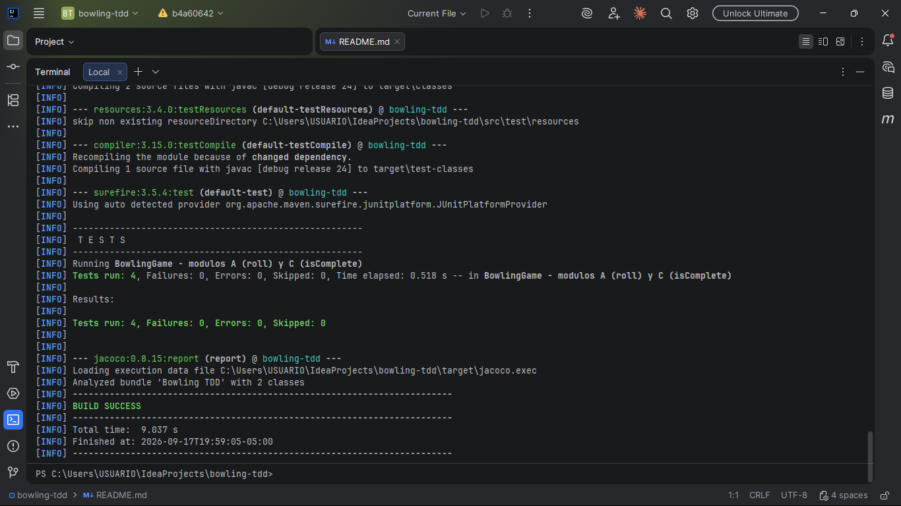
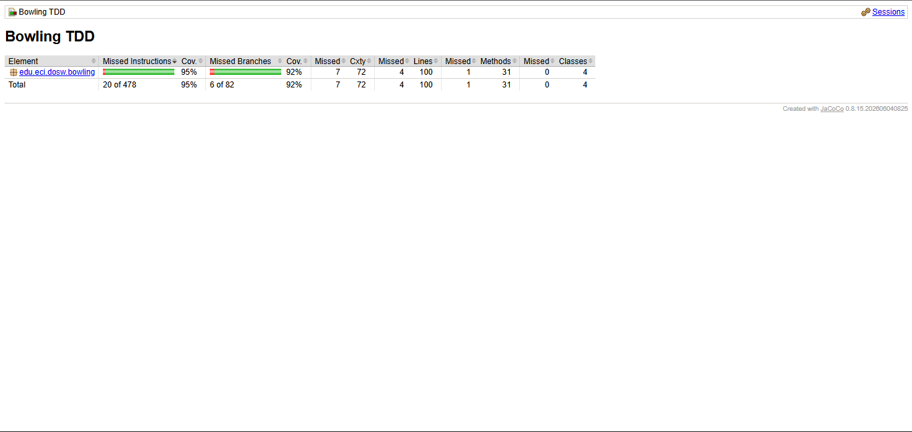
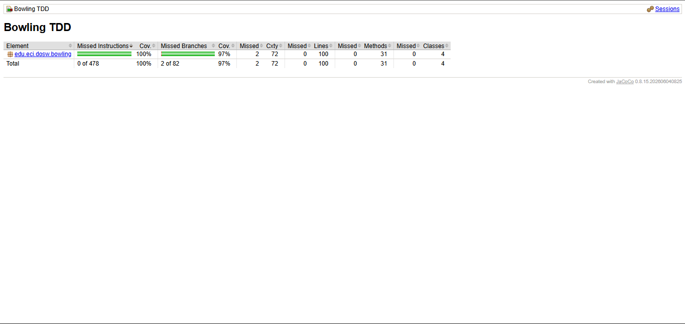
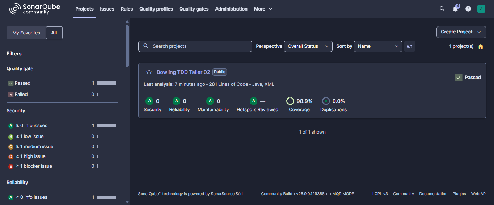
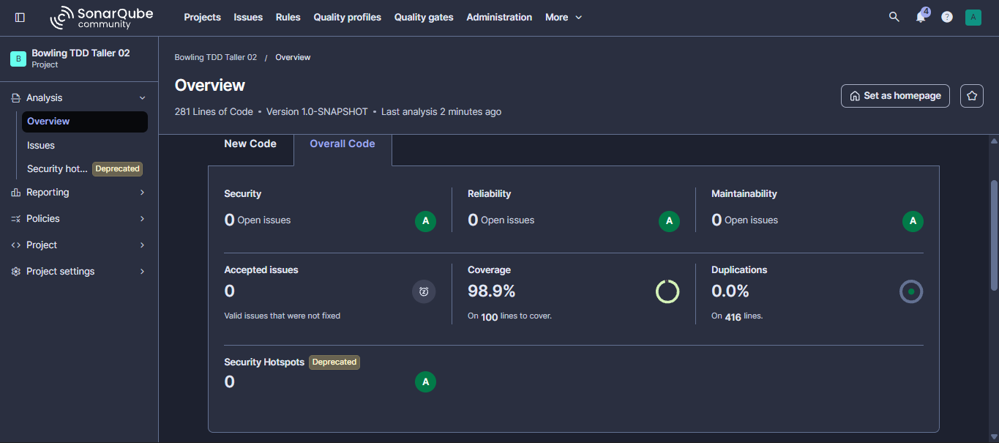
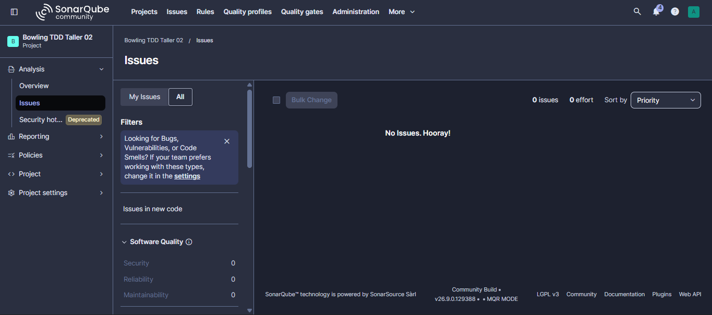
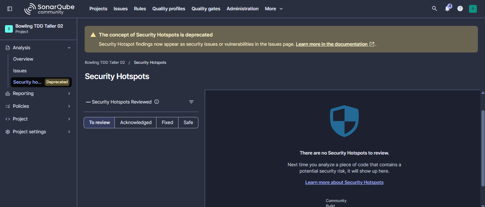

# Bowling TDD — DOSW Taller 2

Motor de puntuación de bowling construido desde cero con Test-Driven Development,
usando JUnit 5, JaCoCo y SonarQube.

| | |
|---|---|
| Asignatura | DOSW |
| Periodo | 2026-2 |
| Profesor | Andrés Martín Cantor Urrego |
| Java | 24 |
| Proyecto Maven | `edu.eci.dosw:bowling-tdd:1.0-SNAPSHOT` |

---

## 1. Identificación

| Campo | Valor |
|---|---|
| Nombre | Juan Nicolás Álvarez Muñoz |
| Código | 1000102233 |
| Correo | juan.amunoz@mail.escuelaing.edu.co |

---

## 2. Descripción

BowlTech S.A.S. administra pistas de bolos y llevaba la puntuación a mano. Con
ese método se olvidaban los bonos de strike, se confundían los spares y el
juego perfecto quedaba mal sumado. Este proyecto reemplaza ese proceso por un
motor de puntuación probado.

### Reglas implementadas

| Situación | Condición | Puntuación |
|---|---|---|
| Tiro normal | Derriba algunos pinos sin completar 10 | Solo los pinos de ese tiro |
| Spare | Derriba los 10 pinos en 2 intentos del mismo frame | 10 más el primer tiro del frame siguiente |
| Strike | Derriba los 10 pinos en el primer intento | 10 más los dos tiros siguientes |
| Frame 10 | Cierra en strike o en spare | Hasta 3 tiros, con los pinos reiniciados |
| Juego perfecto | 12 strikes seguidos | 300 puntos |

### Responsabilidades de cada clase

| Clase | Qué hace |
|---|---|
| `BowlingGame` | Controla el estado del juego. Valida cada tiro (rango 0 a 10, capacidad del frame, juego terminado), decide cuándo avanza de frame y cuándo termina el juego. No calcula el puntaje. |
| `Frame` | Guarda los tiros de un frame y sabe cuántos pinos quedan en pie, cuándo queda cerrado y si terminó en strike o en spare. Aquí están las reglas propias del frame 10. |
| `BowlingScorer` | Recibe la lista de frames y devuelve el puntaje total. No guarda estado. Aplica el bono de spare (1 tiro) y el de strike (2 tiros). |
| `FrameStatus` | Enum con los tres estados: `OPEN`, `SPARE`, `STRIKE`. |

### Casos de prueba

Módulo A, `BowlingGame.roll()`:

| # | Caso | Resultado |
|---|---|---|
| A1 | `roll(0)` | No lanza excepción; el frame registra 0 pinos |
| A2 | `roll(-1)` | `IllegalArgumentException` |
| A3 | `roll(11)` | `IllegalArgumentException` |
| A4 | `roll(7)` y luego `roll(6)` | `IllegalArgumentException` en el segundo tiro |
| A5 | `roll()` con el juego terminado | `IllegalStateException` |
| A6 | `roll(10)` | El frame queda `STRIKE` y avanza al siguiente |
| A7 | `roll(5)` y `roll(5)` | El frame queda `SPARE` |
| A8 | Frame 10 con strike | Acepta 3 tiros sin excepción |

Módulo B, `BowlingScorer.calculate()`:

| # | Caso | Resultado |
|---|---|---|
| B1 | Todos los tiros en 0 | 0 |
| B2 | Sin strikes ni spares (20 tiros de 4) | 80 |
| B3 | Spare en el frame 1 y luego un 3 | El frame 1 puntúa 13; total 16 |
| B4 | Strike en el frame 1 y luego 4 y 3 | El frame 1 puntúa 17; total 24 |
| B5 | Dos strikes seguidos y luego un 5 | 45 |
| B6 | Todos spares con último tiro de 5 | 150 |
| B7 | Juego perfecto, 12 strikes | 300 |
| B8 | `score()` con el juego incompleto | `IllegalStateException` |

Módulo C, `BowlingGame.isComplete()`:

| # | Caso | Resultado |
|---|---|---|
| C1 | Al iniciar | `false` |
| C2 | Con 9 frames completos | `false` |
| C3 | Con 10 frames normales | `true` |
| C4 | Spare en el frame 10 más el tiro de bono | `true`, y `false` antes del bono |
| C5 | Strike en el frame 10 más 2 tiros de bono | `true` |
| C6 | Juego perfecto | `true` |

A estos 22 casos se sumaron 5 pruebas de borde que salieron de revisar el
reporte de cobertura. **Total: 29 pruebas.**

---

## 3. Evidencia TDD

La evidencia principal es el historial de commits: 49 commits en la rama
`feature/AlvarezJuanNicolas_bowling`, uno por cada fase de cada caso. Son 17
fases RED y 32 fases GREEN o REFACTOR. La lista completa está en
[`docs/evidence/bitacora-ciclos-tdd.md`](docs/evidence/bitacora-ciclos-tdd.md).



### Ciclo documentado: caso A4

El caso A4 verifica que dos tiros del mismo frame no puedan sumar más de 10 pinos.

**RED — commit `c03f023`**

Primero escribí la prueba:

```java
@Test
@DisplayName("A4 - dos tiros de un frame no pueden sumar mas de 10")
void twoRollsExceedingTenPins_throwsIllegalArgumentException() {
    BowlingGame game = new BowlingGame();
    game.roll(7);

    assertThrows(IllegalArgumentException.class, () -> game.roll(6));
}
```

En ese punto `roll()` solo validaba el rango de 0 a 10, así que aceptaba el
segundo tiro y la prueba falló:

```
[ERROR] BowlingGameTest.twoRollsExceedingTenPins_throwsIllegalArgumentException
  Expected java.lang.IllegalArgumentException to be thrown, but nothing was thrown.
[ERROR] Tests run: 4, Failures: 1
[INFO] BUILD FAILURE
```



**GREEN — commit `b4a6064`**

Escribí solo lo necesario para que pasara, sin adelantar nada:

```java
Frame frame = currentFrameOrCreate();
int alreadyDown = 0;
for (int rolled : frame.getRolls()) {
    alreadyDown += rolled;
}
if (alreadyDown + pins > MAX_PINS) {
    throw new IllegalArgumentException(
            "Un frame no puede derribar mas de " + MAX_PINS + " pinos");
}
frame.addRoll(pins);
```



**REFACTOR — commit `46dfb45`**

Contar pinos no es tarea de `BowlingGame`: el frame es quien sabe cuántos pinos
tiene en pie. Moví la lógica a `Frame` sin cambiar el comportamiento, y las 4
pruebas siguieron pasando.

```java
// BowlingGame
if (frame.wouldExceedPins(pins)) {
    throw new IllegalArgumentException(
            "Un frame no puede derribar mas de " + Frame.MAX_PINS + " pinos");
}

// Frame
public int pinsKnockedDown() { ... }
public boolean wouldExceedPins(int pins) {
    return pinsKnockedDown() + pins > MAX_PINS;
}
```

Este cambio fue el que después permitió meter la regla del frame 10 dentro de
`Frame` sin tocar `BowlingGame`.

---

## 4. Cobertura con JaCoCo

Umbrales configurados en el `pom.xml`, sin modificar:

| Contador | Mínimo |
|---|---|
| `LINE` | 85 % |
| `BRANCH` | 70 % |

| Momento | Instrucciones | Ramas | Líneas | Métodos |
|---|---|---|---|---|
| Antes de las pruebas de borde (`bc78fc3`) | 95 % | 92 % | 96 de 100 | 30 de 31 |
| Después de las pruebas de borde (`3cae355`) | 100 % | 97 % | 100 de 100 | 31 de 31 |

Los dos momentos pasan el umbral. Las 5 pruebas de borde cerraron las 4 líneas
y el método que faltaban, y subieron la cobertura de ramas de 92 % a 97 %.

Antes, commit `bc78fc3`:



Después, commit `3cae355`:



### Qué pruebas subieron la cobertura

Las 22 pruebas de los módulos A, B y C cubren el flujo principal. El reporte
mostró cinco huecos que ninguna de ellas tocaba, y añadí una prueba para cada uno:

| Hueco en el reporte | Prueba añadida |
|---|---|
| `Frame.standingPins()`, la rama del frame 10 con strike seguido de un tiro parcial, donde los pinos no se reinician otra vez | `tenthFrameAfterStrike_validatesRemainingPins` |
| `Frame.getNumber()` e `isLastFrame()`, que nunca se consultaban directamente | `frames_areNumberedFromOneToTen` |
| `BowlingGame.getFrames()`, sin verificar que la copia fuera inmutable | `getFrames_returnsImmutableCopy` |
| `Frame.getStatus()`, la rama que devuelve `OPEN` | `frameWithStandingPins_isOpen` |
| `BowlingScorer.calculate(null)`, la validación que nunca se ejecutaba | `calculateWithNullFrames_throwsIllegalArgumentException` |

---

## 5. Análisis con SonarQube

Servidor SonarQube Community 26.9.0 levantado en Docker sobre `localhost:9000`.
El token de análisis se pasa por variable de entorno y no queda en el repositorio.
`.sonarqube/`, `.scannerwork/` y `sonar-project.properties` están en el `.gitignore`.

### Resultados

| Métrica | Valor |
|---|---|
| Quality Gate | Passed |
| Security | A, 0 issues |
| Reliability | A, 0 issues |
| Maintainability | A, 0 issues |
| Security Hotspots | 0 |
| Coverage | 98.9 % sobre 100 líneas |
| Duplications | 0.0 % sobre 416 líneas |
| Lines of Code | 281 |





La cobertura que reporta Sonar (98.9 %) no contradice la de JaCoCo (100 % de
líneas). Sonar junta en una sola cifra la cobertura de líneas y la de
condiciones, así que las 2 ramas que JaCoCo marca sin cubrir le bajan una décima.

### Issues encontrados

El análisis no reportó ningún issue. La vista de Issues con el filtro en *All*
muestra 0 issues y 0 effort, y no hubo Security Hotspots que revisar.





Al no haber hallazgos no hubo correcciones que hacer. En la pregunta 04 explico
a qué lo atribuyo.

---

## 6. Pull Requests

Los cambios llegaron a `develop` solo por Pull Request. No hay commits directos
sobre `develop` ni sobre `main`.

| PR | Módulo que cubre | Commits | Fecha de merge | Enlace |
|---|---|---|---|---|
| #1 | Módulo A, validaciones y estado de `roll()` | 21 | | |
| #2 | Módulo C, reglas de cierre del juego | 8 | | |
| #3 | Módulo B, cálculo de puntaje con bonos | 20 | | |
| #4 | Documentación y evidencias | 1 | | |

---

## 7. Reflexión

### 01. ¿Qué caso edge del bowling fue el más difícil de implementar con TDD y por qué?

El frame 10. Es el único donde dejan de valer las dos reglas que el resto del
juego da por sentadas: que un frame tiene dos tiros, y que entre esos dos tiros
no pueden caer más de 10 pinos. En el frame 10 un strike o un spare dan un
tercer tiro y además levantan los pinos otra vez, así que la validación tiene
que preguntarse cuántos pinos hay realmente en pie en ese momento, que no es lo
mismo que restar los pinos ya derribados en el frame.

Lo difícil con TDD fue que el caso A8 solo pedía el frame 10 con strike, y el
código mínimo para pasarlo dejó la regla a medias. El caso C4, el spare en el
frame 10, fue el que destapó el problema: `isComplete()` daba `true` con dos
tiros y el tiro de bono terminaba lanzando `IllegalStateException`. Ese fue el
RED más útil del taller, porque me obligó a darle un nombre propio a la regla en
vez de seguir agregando condicionales: `expectedRolls()` y `pinsWereReset()`.

### 02. ¿Qué parte del código cambió durante REFACTOR sin modificar el comportamiento observable?

Hubo tres refactors con efecto real, los tres con las pruebas en verde antes y después.

El primero, commit `46dfb45`, movió la validación de capacidad de pinos de
`BowlingGame` a `Frame`. Antes `BowlingGame` sumaba a mano los pinos del frame
en curso; después pasó a preguntar `frame.wouldExceedPins(pins)`. Sin ese
cambio, la regla del frame 10 habría terminado como una cadena de `if` dentro
de `roll()`.

El segundo, commit `dd75bd6`, separó en `Frame` los métodos `expectedRolls()` y
`pinsWereReset()`. `isComplete()` y `standingPins()` tenían condicionales
anidados que mezclaban dos preguntas distintas: cuántos tiros faltan y cuántos
pinos hay en pie. Separarlas dejó el frame 10 legible.

El tercero, commit `bc78fc3`, dejó `roll()` como una lista de pasos con nombre:
`validatePinRange`, `validateGameIsOpen`, `currentFrameOrCreate`,
`validateFrameCapacity`, `addRoll` y `advanceIfClosed`.

Ninguno cambió una firma pública ni un mensaje de excepción, así que las pruebas
no notaron la diferencia.

### 03. ¿Qué casos de prueba descubriste al revisar el reporte de cobertura de JaCoCo que no habías considerado antes?

Cinco, todos agregados en el commit `3cae355`.

El primero fue el frame 10 con strike seguido de un tiro parcial. Las pruebas
cubrían `10, 10, 10` y el juego perfecto, pero nunca algo como `10, 7, ...`. Esa
es justamente la rama donde los pinos no se reinician: después de un 10 y un 7
solo quedan 3 pinos en pie, así que un `roll(5)` debe fallar.

El segundo fue `getStatus()` devolviendo `OPEN`. Las pruebas A6 y A7 consultaban
el estado de frames en strike y en spare, pero ninguna preguntaba por un frame
normal, así que esa línea no se ejecutaba nunca.

Los otros tres fueron la numeración de los frames, la inmutabilidad de la lista
que devuelve `getFrames()` y la validación de lista nula en `calculate()`.

Lo que saqué de esto es que el reporte de cobertura no señala pruebas que
falten en general, sino decisiones del código que nadie tomó durante las
pruebas. Los dos primeros casos son reglas del dominio, no detalles menores.

### 04. ¿Qué hallazgo de SonarQube produjo un cambio real en el código?

Ninguno. El análisis cerró con 0 issues en las tres dimensiones y 0 Security
Hotspots, así que no hubo nada que corregir.

Revisando el perfil `java/Sonar way`, las reglas que suelen aparecer en un
ejercicio como este son tres, y en los tres casos el propio ciclo TDD ya las
había evitado antes de correr el análisis.

La primera es la de números mágicos. El 10 aparece muchas veces en las reglas
del bowling, y quedó como `MAX_PINS`, `LAST_FRAME_NUMBER`, `REGULAR_ROLLS` y
`LAST_FRAME_ROLLS` en el refactor `8668fc1`. No lo hice porque Sonar lo pidiera,
sino porque sin esos nombres la regla del frame 10 no se entendía.

La segunda es la de complejidad. El punto de riesgo era `roll()`, que acumula
cuatro validaciones más el avance de frame. El refactor `bc78fc3` lo dejó como
seis llamadas a métodos de dos o tres líneas cada uno.

La tercera es la duplicación. Sonar reporta 0.0 % sobre 416 líneas. El cálculo
de bonos estuvo duplicado entre dos métodos hasta el refactor `ff4fc09`, que los
unificó en `sumOfNextRolls` y `rollsAfter`.

La conclusión que saco es que con 281 líneas de código y seis refactors en el
historial, SonarQube no tenía mucho que encontrar. Aquí funcionó como
confirmación, no como descubrimiento, a diferencia de JaCoCo, que sí destapó
cinco ramas sin probar. Supongo que su valor real aparece en proyectos más
grandes, con más gente escribiendo y sin la costumbre de refactorizar en cada
ciclo.
